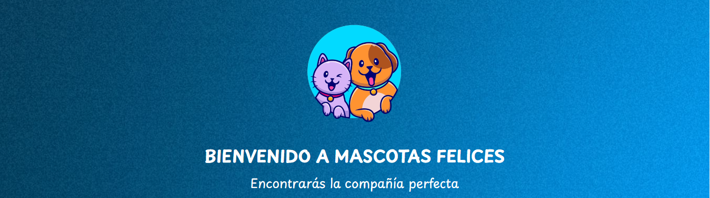


# Desarrollo Web - Comisión 49660
Profesor: Joaquin Viretti

Tutora: Lucila Fortunato

## Proyecto final `Mascotas Felices` (PF+Gutierrez)
Estudiante: Federico Gabriel Gutierrez

### INTRODUCCIÓN

Es un placer que te encuentres acá para compartir el proyecto que he estado realizado con mucho esfuerzo y entusiasmo durante toda la cursada.

Después de pensar varias ideas decidí que el proyecto estaría enfocado: un sitio web que nos facilitara la adopción de mascotas y nos simplificará la conexión con refugios de mascotas que se han encontrado en estado de vulnerabilidad. 

Desde ya quiero agradecerte por su tiempo, estoy muy ansioso por escuchar tus comentarios y sugerencias.

¡Espero que disfrute, vamos a ello!

### 1. MAQUETADO Y WIREFRAMES DESKTOP

* Ingresa a [Maquetado - Google Drive](https://drive.google.com/drive/folders/12dLWbAbDJe6YkE9hYyX2gR960CoZb3ye?usp=sharing). 

* Ingresa a [Wireframes - Moqups](https://app.moqups.com/eGB9kZvXQ7kJDXsbsh99n72Z6GoNOf9W/view/page/a475fbc9c). 

### 2. MAQUETADO Y WIREFRAMES MOBILE

* Ingresa a [Maquetado - Google Drive](https://drive.google.com/drive/folders/1yfhN2kZOwKaAQDJAAEMvlCiDG4_twLsm?usp=drive_link).     

* Ingresa a [Wireframes - Moqups](https://app.moqups.com/bM2mzOjVgworNlr70mcOGylRWLeLhlzq/view/page/adb90c757). 

### 3. ESTILO INICIAL FUNCIONAL

* Ingresa a [Google Sites](https://sites.google.com/view/mascotas--felices/inicio?authuser=0). 

### 4. HTML + CSS + SCSS

* Ingresa a [Google Drive](https://drive.google.com/drive/folders/14aHsRmSo5QPiqHJ3MlVhDLGCcJ1et5xr?usp=sharing). 

### 5. LINK REPOSITORIO GITHUB

* Ingresa a [Github](https://github.com/fedco-gtz/PF-Gutierrez). 

### 6. LINK GITHUB PAGES

* Ingresa a [Github Pages](https://fedco-gtz.github.io/PF-Gutierrez/). 

### 7. LINK NETLIFY

* Ingresa a [Netlify](https://mascotas-felices.netlify.app/). 

### REDES SOCIALES

¡Seguime en mis redes sociales para conocer todos mis proyectos!

&nbsp;&nbsp;&nbsp;

&nbsp;&nbsp;&nbsp;

&nbsp;&nbsp;&nbsp;

&nbsp;&nbsp;&nbsp;

### PROYECTOS
[Desarrollo Web](https://mascotas-felices.netlify.app/)&nbsp;&nbsp;|&nbsp;&nbsp;
[JavaScript](https://vuelasmart.netlify.app/)&nbsp;&nbsp;|&nbsp;&nbsp;
[React Js](https://zapatienda.vercel.app/)

______________________________________________________________________________________________________
### `ÚLTIMA ACTUALIZACIÓN DEL PROYECTO 09/01/2024`

### `ENTREGA DE PRIMERA PRE-ENTREGA 06/11/2023` [DEVOLUCIÓN](https://www.canva.com/design/DAGLUm504kU/unJQ7vysNkxrP8kfoAuPqQ/view?utm_content=DAGLUm504kU&utm_campaign=designshare&utm_medium=link&utm_source=editor) 
### `ENTREGA DE SEGUNDA PRE-ENTREGA 11/12/2023` [DEVOLUCIÓN](https://www.canva.com/design/DAGLUwzWWZ0/SSs9LXrDOg-pvqCz7fnazg/view?utm_content=DAGLUwzWWZ0&utm_campaign=designshare&utm_medium=link&utm_source=editor) 
### `ENTREGA DE TERCERA PRE-ENTREGA 25/12/2023` [DEVOLUCIÓN](https://www.canva.com/design/DAGLU8vsgQk/OWCwfolfqY3-GwgQ9D7dDg/view?utm_content=DAGLU8vsgQk&utm_campaign=designshare&utm_medium=link&utm_source=editor)
### `ENTREGA DE PROYECTO FINAL 09/01/2024` [DEVOLUCIÓN](https://www.canva.com/design/DAGLU39_rTU/zAMTwb9fJtioib_jmwpjRg/view?utm_content=DAGLU39_rTU&utm_campaign=designshare&utm_medium=link&utm_source=editor)

______________________________________________________________________________________________________
### CERTIFICADOS [CLICK ACÁ](https://www.canva.com/design/DAGLUzlJtz8/crTk7cmP379JXQAz_3gfkw/view?utm_content=DAGLUzlJtz8&utm_campaign=designshare&utm_medium=link&utm_source=editor)
